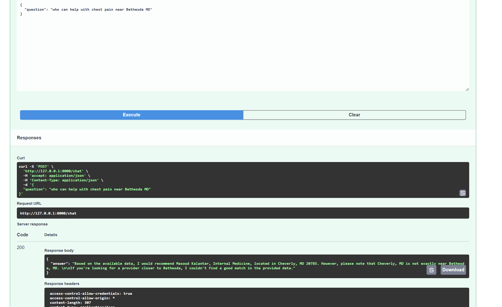

# CMS Provider Data Pipeline + RAG Doctor Finder

A data pipeline that ingests public CMS (Medicare) healthcare provider data,
stores it in Postgres, and exposes a semantic search / RAG chatbot API that
lets users ask natural-language questions (e.g. "who can help with chest
pain near Bethesda MD") and get grounded, relevant provider recommendations.

## Example



Asking a natural-language question returns a grounded answer based on
real retrieved data -- including honestly saying when no good match
exists, rather than fabricating one.

## Architecture

```
CMS API -> ingest_cms.py -> Postgres (providers, practice_locations)
                                     |
                    geocode_locations.py    generate_embeddings.py
                    (lat/lon)                (pgvector embeddings)
                                     |
                               retrieve.py
            (Haversine distance filter + pgvector
             semantic similarity search)
                                     |
                          generate_answer.py
              (LangChain + Groq LLM, grounded in retrieved data)
                                     |
                          main.py (FastAPI)
```

## Tech stack

Python, PostgreSQL + pgvector, SQLAlchemy 2.0, Docker, sentence-transformers,
geopy/Nominatim, LangChain + Groq, FastAPI

## Known limitations / what I'd do for production

- Data density: capped at ~3000 rows for demo speed
- Geocoding: ~70% success rate via free-tier Nominatim
- No real insurance-network data (would need per-payer FHIR integration)
- No orchestration (manual script runs, not Airflow-scheduled)
- No auth/rate limiting on the API

## Debugging notes

1. Silent field-mapping bug: organization_name overwrote individual names
2. Silent no-op update bug: upsert logic gated on a timestamp the data
   source never populates, so fixes never reached existing rows
3. Native Postgres Windows service conflicting with Docker on port 5432